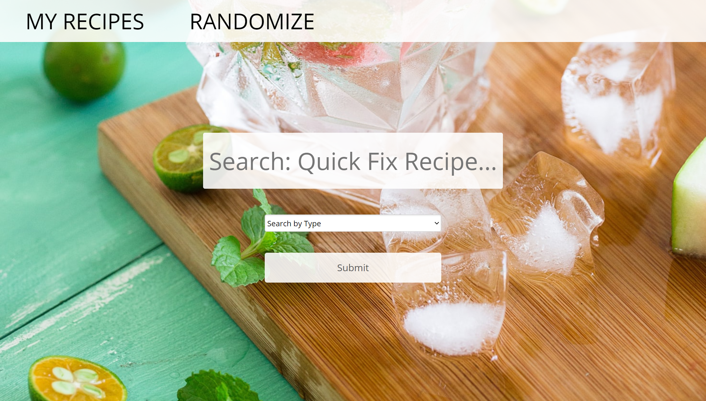
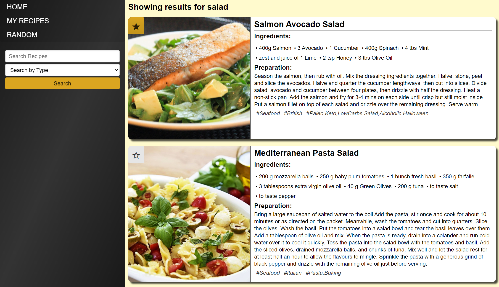
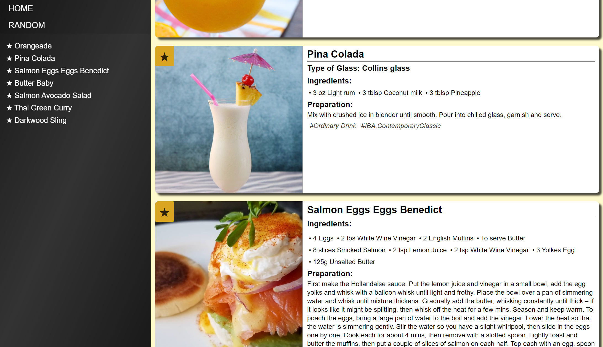

# Quick Fix Recipe 🍽️

## Find New Recipes at the Click of a Button!

## How It Works:

* Upon opening the site, the user is greeted with a landing page that features a randomized image from a curated list of relevant pictures.

* The user can search for new recipes by typing in the search bar and choosing to search by either Food or Drink.

* The search results then display on the page as recipe cards. Each card includes an image of the finished recipe, the relevant information for how to make it themselves, and a save button.

* When the user clicks the save button on a recipe card, that recipe's information is saved to the user's local storage. They can click the save button again to remove that recipe from their saved list.

* The My Recipes page, linked in the navigation bar, use the user's local storage to display only recipes that the user has saved. The page features a Table of Contents that the user can click on to navigate to a specific recipe more easily.

* As an alternative to searching, the user can click the Randomize button in the navigation bar on any page to display a random recipe.

## Links:

🍹 [Live Website](https://kerilp.github.io/quick-fix-recipe/)

🥪 [Source Code](https://github.com/kerilp/quick-fix-recipe)

## Languages & Resources:

Languages: HTML; CSS; JAVASCRIPT

Framework: [Pure CSS](https://purecss.io/)

Images: [Unsplash Source](https://source.unsplash.com/)

Third Party API:

🌮 [TheMealDB](https://www.themealdb.com/api.php) --- An open, crowd-sourced database of recipes from around the world.

🍸 [TheCocktailDB](https://www.thecocktaildb.com/api.php) --- An open, crowd-sourced database of drinks and cocktails from around the world.

## Screenshots

## Collaborators: 

⭐ [Keri Price](https://github.com/kerilp)
⭐ [Yinping Gao](https://github.com/yinping-520)
⭐ [Melissa Vint](https://github.com/Mvint2647)
⭐ [Anthony Carr](https://github.com/acarr13)